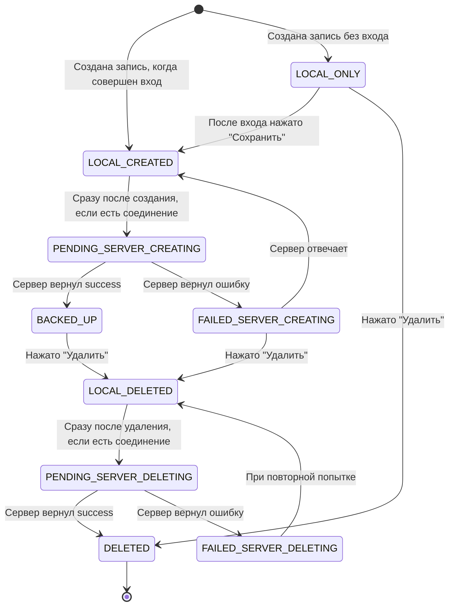
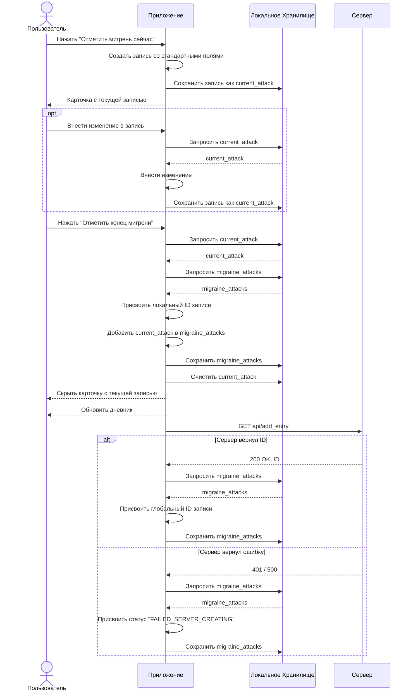

# Архитектура приложения "Мигренозник"

## Описание

"Мигренозник" — веб приложение для регистрации записей мигрени с возможностью сохранения их на сервере.

Основная миссия приложения — максимально облегчить процесс ведения дневника приступов.

## Компоненты

Приложение состоит из двух подсистем: локального дневника и серверного дневника.

Приложение устроено таким образом, чтобы пытаться сохранять все записи на сервер. Локальная часть нужна для быстрого сохранения записей в случае отсутствия входа или при совершенном входе и отсутствии интернета.

## Машина состояний записей



## Создание записи о приступе мигрени



## API

### GET delete_entry

#### Параметры
|Имя|Тип|Описание|
|-|-|-|
|id|Число|Глобальный ID записи, которую нужно удалить|

#### Возвращаемое значение
```json
{
    "success": true/false # true - запись удалена
}
```

#### Возможные ошибки
Пока ошибки не предусмотрены.

### GET entries

#### Параметры
Функция не принимает параметры.

#### Возвращаемое значение
```json
{
    "entries": [], # список записей
    "success": true # флаг успешности операции
}
```

#### Возможные ошибки
Пока ошибки не предусмотрены.