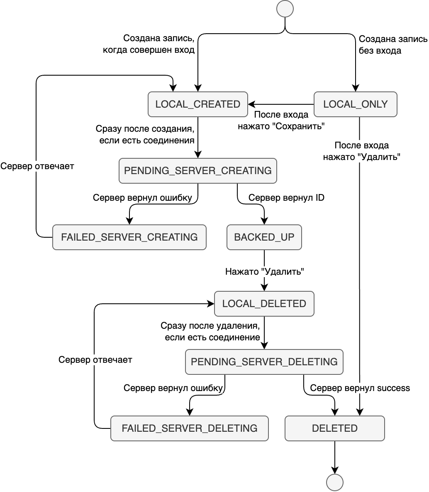

# Архитектура приложения "Мигренозник"

## Описание

"Мигренозник" — веб приложение для регистрации записей мигрени с возможностью сохранения их на сервере.

## Компоненты

Приложение состоит из двух подсистем: локального дневника и серверного дневника.

Приложение устроено таким образом, чтобы пытаться сохранять все записи на сервер. Локальная часть нужна для быстрого сохранения записей в случае отсутствия входа или при совершенном входе и отсутствии интернета.

## Машина состояний записей

## API

### GET delete_entry

#### Параметры
|Имя|Тип|Описание|
|-|-|-|
|id|Число|Глобальный ID записи, которую нужно удалить|

#### Возможные ошибки
Пока ошибки не предусмотрены.